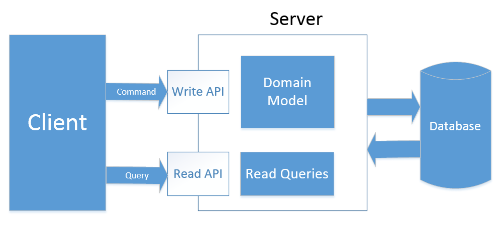
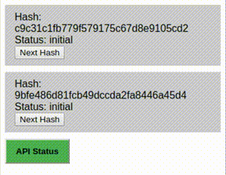
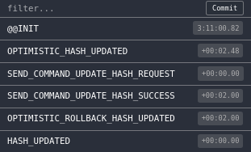
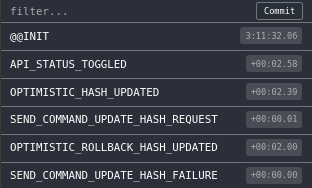

# Optimistic Updates and CQRS

Let’s talk today about optimistic UIs and CQRS.

Command query responsibility segregation (CQRS) uses separate Query and Command objects to retrieve and modify data, respectively.

One of its evangelist Greg Young is strongly encouraging this approach, and gives some really cool articles and interviews around this [http://cqrs.nu/Faq](http://cqrs.nu/Faq).

  

Optimistic UIs don’t wait for an operation to finish to update to the final state. They immediately switch to the final state, showing fake data for the time while the real operation is still in-progress.

This is especially true when on mobile connections.

One solution to this problem is to perform API calls in an optimistic way: once an action requiring API interaction is triggered, we assume a positive response from the server and we dispatch the expected results before the actual API response is received. In case of an API failure (e.g. server errors or timeouts), the previously dispatched results will be reverted and the application state will be rolled-back. By doing this, the application will become more responsive and only in case of failure the user will be presented with an error and its action will be reverted.

Let's take a look at a simple React + Redux example :

Step-by-step instruction:

* Dispatch optimistic action
* Send a command and waiting for real action .
* If the command failed, then stop waiting for a real action and dispatch an optimistic rollback action.
* When a real action is received, dispatch an optimistic rollback action and apply the real action.

#### Optimistic calculation of the next hash
```js
const optimisticCalculateNextHashMiddleware = (store) => {
    const tempHashes = {};
    
    const api = createApi(store);
    
    return next => action => {
        switch (action.type) {
            case SEND_COMMAND_UPDATE_HASH_REQUEST: {
                const { aggregateId, hash } = action;
                
                // Save the previous data
                const { hashes } = store.getState()
                const prevHash = hashes[aggregateId].hash;
                tempHashes[aggregateId] = prevHash
               
                // Dispatch an optimistic action
                store.dispatch({
                    type: OPTIMISTIC_HASH_UPDATED,
                    aggregateId,
                    hash
                });
                
                // Send a command
                api.sendCommandCalculateNextHash(aggregateId, hash)
                    .then(
                        () => store.dispatch({
                            type: SEND_COMMAND_UPDATE_HASH_SUCCESS,
                            aggregateId,
                            hash
                        })
                    )
                    .catch(
                        (err) => store.dispatch({
                            type: SEND_COMMAND_UPDATE_HASH_FAILURE,
                            aggregateId,
                            hash
                        })
                    );             
                break;
            }
            case SEND_COMMAND_UPDATE_HASH_SUCCESS: {
                break;
            }
            case SEND_COMMAND_UPDATE_HASH_FAILURE: {
                const { aggregateId } = action;
                
                const hash = tempHashes[aggregateId];
                
                delete tempHashes[aggregateId];
                
                store.dispatch({
                    type: OPTIMISTIC_ROLLBACK_HASH_UPDATED,
                    aggregateId,
                    hash
                });
                break;
            }
            case HASH_UPDATED: {
                const { aggregateId } = action;
                
                const hash = tempHashes[aggregateId];
                
                delete tempHashes[aggregateId];
                
                store.dispatch({
                    type: OPTIMISTIC_ROLLBACK_HASH_UPDATED,
                    aggregateId,
                    hash
                });              
                break;
            }
        }
        
        next(action);
    }
}
```


### Live Demo 
https://codepen.io/MrCheater/pen/KZreRo

#### Optimistic Update (Success)

|  |  |
|---|---|

#### Optimistic Update (Failure)

|  |  |
|---|---|

## Conclusion

Optimistic UIs can make your app more fluent, straightforward and enjoyable for a user.

