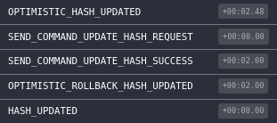

# Optimistic Updates and CQRS


The UI implements optimistic updates; it shows the update before it is processed on the server to make it appear fast to the user.

//

In order to make optimistic updates and be able to predict the state of the UI after some user action, you will need to keep some of your application data on the client.

//

When you are doing optimistic UI updates, the client tries to predict the outcome of some operation. Most of the time, this works great, but sometimes the client just doesn’t have enough information to make an accurate prediction. Maybe it’s missing some permissions data, maybe it doesn’t know about some modification that a different client made, etc. Plus, as any experienced developer will know, you can’t ever trust client code to do the right thing since users can modify the code running in their browser.

At first, this sounds like an easy problem — of course, the server always wins, so can’t you just use the result from the server? The answer is yes, but you need to make sure you have rolled back all of the operations done on the client as part of the optimistic UI update. It turns out it is actually really hard to do this when you have multiple user actions happening in parallel.

//


It depends on the critical nature of the action being performed. It is a balance between UX vs. need for accuracy.

"non-critical" recommend => Instant UI Update: Completely Optimistic

Likes, shares, feed actions, etc are examples of instances where the UI can be optimistically updated.

In the event of a failure the user can be notified and the UI can be updated (if the user is still in the app...) to reflect the state of the backend system. In a few instances the updates might fail, and the user may or may not see the follow-up notification, but it's generally okay because the action being performed wasn't really that important. A few misses in a million transaction is acceptable.

"critical systems" recommended => Updating: Partially pessimistic

Cash transfers, submitting taxes, checking for an airline flight, are a few examples of places where an optimistic update is generally a terrible idea because a false positive can be very consequential to the user.

Even if only a few users are exposed to inaccurate successful confirmations in a high volume system, the negative impact to those users are potentially very significant. As an example, a customer misses a flight because the airline website UI said they were checked-in, when they really weren't, - the UI updated optimistically, but the backend transaction failed. In that instance, they would have a right to be really unhappy, and report a poor user experience.

What if you correct the 'optimistic' UI update with the real system status seconds later? There is no guarantee that a user will still be using the app or webpage in the event the UI is subsequently updated with a failure notification after the actually response is processed, so a chance will always exist that the optimistic and possibly inaccurate response is all the user sees.

So the safe choice here would be to display an "Updating" indicator to the user, and then change the UI to "confirm" the change when a response is received from the backend indicating that the action the requested was actually carried out (successfully or otherwise). The user is happy and trust in the system is maintained.

//


Web applications взаимодействуют сервеной стороной через API

network calls which could potentially be slow and flaky, making your application sluggish

 This is especially true when on mobile connections.
 
 One solution to this problem is to perform API calls in an optimistic way: once an action requiring API interaction is triggered, we assume a positive response from the server and we dispatch the expected results before the actual API response is received. In case of an API failure (e.g. server errors or timeouts), the previously dispatched results will be reverted and the application state will be rolled-back. By doing this, the application will become more responsive and only in case of failure the user will be presented with an error and its action will be reverted.
 
 Let’s have a look at one example by using the usual TODO list scenario. Assuming the case where a user adds a new “Learn React” TODO item and this needs to be saved in a Mongo collection, the outcome could either be:
 Success: the add-item API call is triggered and the newly item is immediately added in the UI. When the API response comes back successfully, nothing needs updating;
 Failure: the add-item API call is triggered and the newly item is immediately added in the UI. If the API returns an error or times-out, the application is reverted to its pre add-item state causing the item to be removed from the UI. An error should also be displayed at this point.
 
 This technique makes your application feel very fast and responsive even with poor connectivity.
 There are a number of ways optimistic updates can be achieved in a React/Redux application.
 
Steps:
* 
* Dispatch optimistic action
* Send a command and waiting for real action .
* If the command failed, then stop waiting for a real action and dispatch an optimistic rollback action.
* When a real action is received, dispatch an optimistic rollback action and apply the real action.


### Optimistic calculation of the next hash
```js
const optimisticCalculateNextHashMiddleware = (store) => {
    const tempHashes = {};
    
    const api = createApi(store);
    
    return next => action => {
        switch (action.type) {
            case SEND_COMMAND_UPDATE_HASH_REQUEST: {
                const { aggregateId, hash } = action;
                
                // Save the previous data
                const { hashes } = store.getState()
                const prevHash = hashes[aggregateId].hash;
                tempHashes[aggregateId] = prevHash
               
                // Dispatch an optimistic action
                store.dispatch({
                    type: OPTIMISTIC_HASH_UPDATED,
                    aggregateId,
                    hash
                });
                
                // Send a command
                api.sendCommandCalculateNextHash(aggregateId, hash)
                    .then(
                        () => store.dispatch({
                            type: SEND_COMMAND_UPDATE_HASH_SUCCESS,
                            aggregateId,
                            hash
                        })
                    )
                    .catch(
                        (err) => store.dispatch({
                            type: SEND_COMMAND_UPDATE_HASH_FAILURE,
                            aggregateId,
                            hash
                        })
                    );             
                break;
            }
            case SEND_COMMAND_UPDATE_HASH_SUCCESS: {
                break;
            }
            case SEND_COMMAND_UPDATE_HASH_FAILURE: {
                const { aggregateId } = action;
                
                const hash = tempHashes[aggregateId];
                
                delete tempHashes[aggregateId];
                
                store.dispatch({
                    type: OPTIMISTIC_ROLLBACK_HASH_UPDATED,
                    aggregateId,
                    hash
                });
                break;
            }
            case HASH_UPDATED: {
                const { aggregateId } = action;
                
                const hash = tempHashes[aggregateId];
                
                delete tempHashes[aggregateId];
                
                store.dispatch({
                    type: OPTIMISTIC_ROLLBACK_HASH_UPDATED,
                    aggregateId,
                    hash
                });              
                break;
            }
        }
        
        next(action);
    }
}
```


### Live Demo 
https://codepen.io/MrCheater/pen/KZreRo

#### Optimistic Update (Success)

|  |  |
|---|---|

#### Optimistic Update (Failure)

|  |  |
|---|---|


 
 