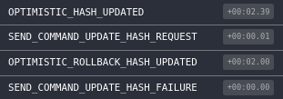

# Optimistic Updates and CQRS

Web applications взаимодействуют сервеной стороной через API

network calls which could potentially be slow and flaky, making your application sluggish

 This is especially true when on mobile connections.
 
 One solution to this problem is to perform API calls in an optimistic way: once an action requiring API interaction is triggered, we assume a positive response from the server and we dispatch the expected results before the actual API response is received. In case of an API failure (e.g. server errors or timeouts), the previously dispatched results will be reverted and the application state will be rolled-back. By doing this, the application will become more responsive and only in case of failure the user will be presented with an error and its action will be reverted.
 
 Let’s have a look at one example by using the usual TODO list scenario. Assuming the case where a user adds a new “Learn React” TODO item and this needs to be saved in a Mongo collection, the outcome could either be:
 Success: the add-item API call is triggered and the newly item is immediately added in the UI. When the API response comes back successfully, nothing needs updating;
 Failure: the add-item API call is triggered and the newly item is immediately added in the UI. If the API returns an error or times-out, the application is reverted to its pre add-item state causing the item to be removed from the UI. An error should also be displayed at this point.
 
 This technique makes your application feel very fast and responsive even with poor connectivity.
 There are a number of ways optimistic updates can be achieved in a React/Redux application.
 
Steps:
* Dispatch optimistic action, send a command and waiting for real action .
* If the command failed, then stop waiting for a real action and dispatch an optimistic rollback action.
* When a real action is received, dispatch an optimistic rollback action and apply the real action.


### Optimistic calculation of the next hash
```js
const optimisticCalculateNextHashMiddleware = (store) => {
    const tempHashes = {};
    
    const api = createApi(store);
    
    return next => action => {
        switch (action.type) {
            case SEND_COMMAND_UPDATE_HASH_REQUEST: {
                const { aggregateId, hash } = action;
                
                // Save the previous data
                const { hashes } = store.getState()
                const prevHash = hashes[aggregateId].hash;
                tempHashes[aggregateId] = prevHash
               
                // Dispatch an optimistic action
                store.dispatch({
                    type: OPTIMISTIC_HASH_UPDATED,
                    aggregateId,
                    hash
                });
                
                // Send a command
                api.sendCommandCalculateNextHash(aggregateId, hash)
                    .then(
                        () => store.dispatch({
                            type: SEND_COMMAND_UPDATE_HASH_SUCCESS,
                            aggregateId,
                            hash
                        })
                    )
                    .catch(
                        (err) => store.dispatch({
                            type: SEND_COMMAND_UPDATE_HASH_FAILURE,
                            aggregateId,
                            hash
                        })
                    );             
                break;
            }
            case SEND_COMMAND_UPDATE_HASH_SUCCESS: {
                break;
            }
            case SEND_COMMAND_UPDATE_HASH_FAILURE: {
                const { aggregateId } = action;
                
                const hash = tempHashes[aggregateId];
                
                delete tempHashes[aggregateId];
                
                store.dispatch({
                    type: OPTIMISTIC_ROLLBACK_HASH_UPDATED,
                    aggregateId,
                    hash
                });
                break;
            }
            case HASH_UPDATED: {
                const { aggregateId } = action;
                
                const hash = tempHashes[aggregateId];
                
                delete tempHashes[aggregateId];
                
                store.dispatch({
                    type: OPTIMISTIC_ROLLBACK_HASH_UPDATED,
                    aggregateId,
                    hash
                });              
                break;
            }
        }
        
        next(action);
    }
}
```


### Live Demo 
https://codepen.io/MrCheater/pen/KZreRo

#### Optimistic Update (Success)

|  |  |
|---|---|

#### Optimistic Update (Failure)

|  |  |
|---|---|


 
 